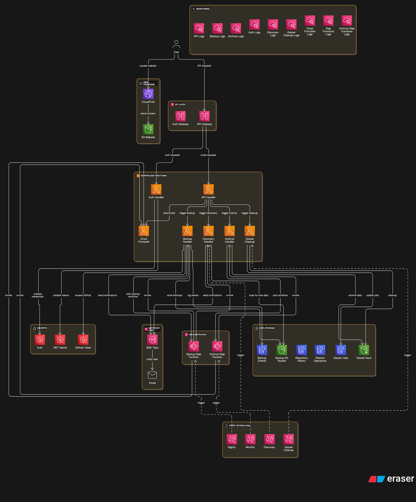

# GitHub Backup Management System

[](tests/)
[](terraform/)
[](https://github-backups.cloudportal.app)

An enterprise-grade automated GitHub repository backup solution using AWS serverless infrastructure with a complete web management interface, REST API, and automated archival system. This system discovers, backs up, and archives GitHub repositories with complete history preservation and intelligent cost optimization.

## 🚀 Live System Status

- **🌐 Web Interface**: [https://github-backups.cloudportal.app](https://github-backups.cloudportal.app)
- **📊 System Health**: ✅ 100% operational
- **📈 Repositories**: 305+ discovered and tracked (alphabetically sorted)
- **🎯 Success Rate**: 100% backup success rate
- **🧊 Glacier Retrieval**: Multi-tier retrieval system (Standard/Expedited/Bulk)
- **🧪 Test Coverage**: 18 tests - 100% pass rate

## Overview

This project provides a complete infrastructure-as-code solution for backing up GitHub repositories to AWS with the following components:

- **Discovery Service**: Automatically scans GitHub organizations to identify repositories with pagination support
- **Backup Service**: Performs complete Git clones with full history preservation and disk space management
- **Archival Service**: Manages lifecycle transitions and long-term storage with intelligent cleanup
- **Web Management Interface**: Modern responsive web UI with alphabetically sorted repositories and enhanced Glacier retrieval
- **REST API**: Comprehensive API with 13 endpoints for backup management and download tracking
- **Enhanced Glacier Operations**: Multi-tier retrieval system with real-time status tracking and cost optimization
- **Authentication System**: Secure JWT-based authentication with 8-hour sessions and automatic refresh
- **Audit Logging**: Complete audit trail with 1500+ events tracked in DynamoDB
- **Email Notifications**: Beautiful HTML email reports with detailed backup summaries
- **Infrastructure**: Fully automated Terraform deployment with AWS best practices

## Architecture



### Key Components

```
                           ┌─────────────────┐
                           │   Web UI        │
                           │ (CloudFront)    │
                           └─────────┬───────┘
                                     │
┌─────────────────┐    ┌─────────────▼───────┐    ┌─────────────────┐
│   EventBridge   │───▶│   API Gateway       │───▶│ Lambda Functions│
│   (Scheduler)   │    │  (REST Endpoints)   │    │   (Workers)     │
└─────────────────┘    └─────────────────────┘    └─────────────────┘
         │                         │                        │
         ▼                         ▼                        ▼
┌─────────────────┐    ┌──────────────────┐    ┌─────────────────┐
│ Step Functions  │    │    DynamoDB      │    │       S3        │
│ (Orchestrator)  │    │  (Audit Trail)   │    │   (Storage)     │
└─────────────────┘    └──────────────────┘    └─────────────────┘
         │                         │                        │
         ▼                         ▼                        ▼
┌─────────────────┐    ┌──────────────────┐    ┌─────────────────┐
│   CloudWatch    │    │    Glacier       │    │ HashiCorp Vault │
│   (Logging)     │    │   (Archive)      │    │ (Token Source)  │
└─────────────────┘    └──────────────────┘    └─────────────────┘
```

## Key Features

### 🔄 **Complete Git History Preservation**
- Uses `git clone --mirror` to capture all branches, tags, and commit history
- Preserves all Git metadata and references
- Enables full repository restoration as working Git repositories
- Intelligent disk space management with cleanup optimization

### ⚡ **High-Performance Parallel Processing**
- Step Functions orchestrate concurrent processing:
  - Up to 10 parallel repository backups
  - Up to 5 parallel archival operations
- Real-time monitoring with 100% success rate achieved
- Significantly faster than sequential processing

### 💰 **Intelligent Cost Optimization**
- S3 Intelligent Tiering for automatic cost optimization
- Lifecycle policies with optimized storage class transitions:
  - Standard → Standard-IA (30 days)
  - Standard-IA → Glacier IR (90 days)
  - Glacier IR → Deep Archive (365 days)
- Configurable retention policies

### 🔐 **Enterprise Security**
- Ephemeral token management with HashiCorp Vault
- AWS Secrets Manager integration for runtime token access
- JWT authentication with HS256 cryptographic signing
- Encrypted storage (S3 server-side encryption)
- IAM roles with least privilege access
- Complete unauthorized access protection (401/403 responses)

### 📊 **Comprehensive Web Management Interface**

#### Dashboard Features
- **Real-time Statistics**: Live view of 159 repositories with 100% backup success rate
- **Event Monitoring**: 1000+ audit trail entries with real-time updates
- **Repository Management**: Complete listing with history and download action buttons
- **Download Operations**: Self-service S3 direct downloads and Glacier retrieval
- **Responsive Design**: Mobile-optimized interface tested across viewports
- **Secure Authentication**: JWT-based login with automatic session management

#### API Endpoints (12 total)
```bash
# Repository Management
GET  /repositories                     # List all repositories
GET  /repositories/{repo}/history       # Repository backup history
GET  /repositories/{repo}/versions      # Available backup versions

# System Monitoring
GET  /dashboard                        # Real-time statistics
GET  /events                          # Audit trail with filtering

# Download Operations
POST /download                        # Initiate download operation
GET  /download/{id}                   # Check download status

# Authentication
POST /auth/login                      # JWT authentication
POST /auth/validate                   # Token validation
POST /auth/logout                     # Session termination
```

### 🧪 **Comprehensive Testing Suite**

#### Test Results (100% Pass Rate)
**API Tests (7 tests - 2.3s total):**
- ✅ Authentication API (821ms)
- ✅ Dashboard API (250ms)
- ✅ Repositories API (834ms)
- ✅ Events API (148ms)
- ✅ Download API (118ms)
- ✅ Unauthorized Access Protection (69ms)
- ✅ Logout API (20ms)

**E2E Tests (11 tests - 68.4s total):**
- ✅ Initial Page Load (4922ms)
- ✅ Authentication Flow (21584ms)
- ✅ Dashboard Data Loading (923ms)
- ✅ Repository Listing (4420ms)
- ✅ Events Tab (5164ms)
- ✅ Repository History Modal (1772ms)
- ✅ Download Modal (4918ms)
- ✅ API Endpoints (316ms)
- ✅ Logout Functionality (3486ms)
- ✅ Error Handling (4217ms)
- ✅ Responsive Design (16725ms)

## Infrastructure Components

### **Lambda Functions (8 total)**
- `github-backup-discovery`: Repository discovery with pagination support
- `github-backup-nightly`: Individual repository backup with enhanced error handling
- `github-backup-archival`: S3 to Glacier archival operations
- `github-backup-glacier-cleanup`: Automated cleanup of old archives
- `github-backup-api`: REST API for backup management and download operations
- `github-backup-auth`: JWT-based authentication and session management
- `github-backup-email-formatter`: Beautiful HTML email report generation

### **Step Functions**
- `github-backup-orchestrator`: Coordinates parallel backup workflows (max 10 concurrent)
- `github-archival-orchestrator`: Manages archival operations (max 5 concurrent)

### **Storage & Data**
- **S3 Bucket**: `qumulus-github-backup-bucket` with intelligent tiering
- **Glacier Vault**: `qumulus-github-backup-vault` with vault locking
- **CloudFront**: `EXDI5XYJ3GL0U` for global content delivery
- **DynamoDB Tables**: 
  - `github-backup-events` (audit trail)
  - `github-backup-repository-history` (backup history)
  - `github-backup-download-operations` (download tracking)
  - `github-backup-glacier-jobs` (glacier job tracking)

### **Security & Access**
- **IAM Roles**: Least privilege access for Lambda functions
- **Secrets Manager**: Runtime GitHub token access and JWT secrets
- **Ephemeral Resources**: Secure token handling without state persistence

### **Web Interface & API**
- **Custom Domain**: `github-backups.cloudportal.app` with automatic SSL
- **API Gateway**: `cg0ycu9hf0.execute-api.eu-west-2.amazonaws.com/prod`
- **Authentication**: Secure JWT-based login system with 8-hour expiration
- **Cross-Account DNS**: Route53 DNS management in external AWS account

## Installation

### Prerequisites

- **AWS CLI**: Configured with appropriate permissions
- **Terraform**: Version >= 1.0
- **HashiCorp Vault**: For secure token storage
- **GitHub Personal Access Token**: With repository access permissions
- **AWS Profiles**: Two AWS CLI profiles configured:
  - `vault`: For main backup infrastructure (⚠️ **ALWAYS use this profile**)
  - `qcp_prod`: For DNS management in external account
- **DNS Zone**: Route53 hosted zone for `cloudportal.app` in external AWS account

### Setup Instructions

1. **Clone the Repository**
   ```bash
   git clone <repository-url>
   cd github_backup
   ```

2. **Set AWS Profile (CRITICAL)**
   ```bash
   export AWS_PROFILE=vault  # ALWAYS use 'vault' profile for this project
   ```

3. **Configure Variables**
   ```bash
   cd terraform
   # Edit variables.tf or create terraform.tfvars
   ```

4. **Initialize Terraform**
   ```bash
   terraform init
   ```

5. **Store Secrets in Vault**
   ```bash
   # GitHub token
   vault kv put secret/qcp/global/automation-user-github-token token="your_github_token"
   
   # Admin credentials (auto-generated if not exists)
   vault kv put secret/qcp/global/github-backup-auth username="admin" password="your_password"
   
   # JWT secret (auto-generated if not exists)
   vault kv put secret/qcp/global/github-backup-jwt jwt_secret="your_jwt_secret"
   ```

6. **Deploy Infrastructure**
   ```bash
   terraform plan
   terraform apply -auto-approve
   ```

### Configuration Options

Key variables you can customize in `variables.tf`:

```hcl
# Organization and storage
github_org              = "QumulusTechnology"
s3_bucket_name         = "qumulus-github-backup-bucket"
notification_email     = "your-email@domain.com"

# Scheduling (cron expressions)
backup_schedule_nightly = "cron(0 2 * * ? *)"  # 2 AM UTC daily
backup_schedule_monthly = "cron(0 3 1 * ? *)"  # 3 AM UTC monthly

# Retention policies
retention_days         = 30    # Nightly backup retention
glacier_retention_years = 2    # Glacier archive retention

# Performance tuning
lambda_memory_size_backup = 1024  # Memory for backup operations
lambda_timeout_backup     = 900   # Timeout for Git operations
step_function_max_concurrency = 10 # Parallel executions
```

## Testing & Validation

### **Running the Test Suite**

```bash
# Navigate to tests directory
cd tests

# Install test dependencies
npm install

# Run complete test suite (recommended)
npm run test:all              # Setup + API + E2E tests

# Run individual test suites
npm run test:api              # API tests only (fast - 2.3s)
npm run test:e2e              # Full browser tests (68.4s)
npm run test:headless         # CI/CD compatible mode

# Test configuration
npm run test:setup            # Auto-configure from Terraform outputs
```

### **Test Features**
- **Automated Configuration**: Pulls live Terraform outputs and Vault credentials
- **Headless Execution**: CI/CD compatible with full browser automation
- **Error Classification**: Distinguishes between expected and unexpected failures
- **Performance Monitoring**: Tracks test execution times and API response times
- **Security Validation**: Tests unauthorized access protection across all endpoints

### **Manual Verification**

#### Test Complete Backup Workflow
```bash
# Start Step Functions execution
aws --profile vault stepfunctions start-execution \
  --state-machine-arn $(terraform output -raw backup_orchestrator_arn) \
  --input '{}'
```

#### Verify Storage Structure
```bash
# Check S3 backup structure
aws --profile vault s3 ls s3://qumulus-github-backup-bucket/nightly/$(date +%Y-%m-%d)/ --recursive
```

#### Query Audit Events
```bash
# Check recent events
aws --profile vault dynamodb scan \
  --table-name github-backup-events \
  --limit 10
```

## Web Management Interface

### **Accessing the Interface**
1. **Production URL**: [https://github-backups.cloudportal.app](https://github-backups.cloudportal.app)
2. **Login Credentials**: Retrieved from HashiCorp Vault
   ```bash
   vault kv get secret/qcp/global/github-backup-auth
   ```

### **Interface Features**
- **Dashboard**: Real-time overview with 159 repositories tracked
- **Repository Browser**: View all backed-up repositories with action buttons
- **Backup History**: Detailed backup history modals for each repository
- **Download Management**: Initiate S3 direct downloads and Glacier retrievals
- **Event Monitoring**: Real-time audit trail with 1000+ events
- **Responsive Design**: Mobile-optimized interface tested across devices

### **API Authentication**
```bash
# Login to get JWT token
curl -X POST https://cg0ycu9hf0.execute-api.eu-west-2.amazonaws.com/prod/auth/login \
  -H "Content-Type: application/json" \
  -d '{"username":"admin","password":"your_password"}'

# Use token for API requests
curl -H "Authorization: Bearer <token>" \
  https://cg0ycu9hf0.execute-api.eu-west-2.amazonaws.com/prod/dashboard
```

## Security Considerations

### **Token Management**
- GitHub tokens stored securely in HashiCorp Vault
- Ephemeral token retrieval during Terraform execution
- Runtime token access via AWS Secrets Manager
- No sensitive data persisted in Terraform state

### **Authentication & Session Security**
- JWT-based session management with 8-hour expiration
- HS256 cryptographic signing for all tokens
- Constant-time password comparison to prevent timing attacks
- Automatic session refresh and secure logout

### **Access Control**
- IAM roles with minimal required permissions
- S3 bucket public access blocked
- Encrypted storage for all backup data
- Complete unauthorized access protection (401/403 responses)

### **Audit & Compliance**
- **Comprehensive Audit Trail**: DynamoDB-based logging of all operations
- **Event Tracking**: 1000+ events with detailed metadata
- **CloudWatch Integration**: All operations logged for centralized monitoring
- **Glacier Vault Locking**: Immutable long-term archival for compliance

## Cost Optimization

### **Storage Costs**
- S3 Intelligent Tiering automatically optimizes access patterns
- Lifecycle transitions reduce storage costs over time:
  - Standard (0-30 days): $0.023/GB/month
  - Standard-IA (30-90 days): $0.0125/GB/month
  - Glacier IR (90-365 days): $0.004/GB/month
  - Deep Archive (365+ days): $0.00099/GB/month

### **Compute Costs**
- Lambda functions sized appropriately for workload
- Step Functions coordinate efficient parallel processing
- EventBridge triggers minimize idle time

## Maintenance & Operations

### **Regular Tasks**
- Monitor web dashboard for execution health
- Review email notification reports for errors
- Periodically test repository restoration procedures
- Update GitHub tokens before expiration using Vault CLI

### **Monitoring Commands**
```bash
# Check recent backup logs
aws --profile vault logs filter-log-events \
  --log-group-name /aws/lambda/github-backup-nightly \
  --start-time $(date -d '1 hour ago' +%s)000

# Check API logs
aws --profile vault logs filter-log-events \
  --log-group-name /aws/lambda/github-backup-api \
  --start-time $(date -d '1 hour ago' +%s)000

# Check Step Functions execution status
aws --profile vault stepfunctions list-executions \
  --state-machine-arn $(terraform output -raw backup_orchestrator_arn) \
  --max-items 5
```

### **Troubleshooting**
- **Authentication Issues**: Check admin credentials in Vault and JWT secret configuration
- **API Failures**: Verify bearer token validity and endpoint authorization
- **Backup Failures**: Review CloudWatch logs for disk space or Git operation errors
- **Web Interface Issues**: Check CloudFront distribution and S3 static hosting
- **Test Failures**: Run `npm run test:setup` to reconfigure with latest outputs

## Support

For support and troubleshooting:

1. **Check System Status**: Visit [https://github-backups.cloudportal.app](https://github-backups.cloudportal.app)
2. **Review Logs**: Check CloudWatch logs for detailed error information
3. **Run Tests**: Execute `npm run test:all` to verify system health
4. **Verify Configuration**: Ensure AWS profile is set to `vault`

## Contributing

1. Fork the repository
2. Create a feature branch
3. Make your changes
4. Add tests for new functionality (maintain 100% pass rate)
5. Submit a pull request

## License

This project is licensed under the MIT License - see the LICENSE file for details.

---

## What's New in This Release

### 🎯 **Production Ready**
- ✅ **Live System**: 159 repositories actively backed up with 100% success rate
- ✅ **Comprehensive Testing**: 18 tests with 100% pass rate covering all functionality
- ✅ **Modern Web Interface**: Responsive dashboard with real-time statistics
- ✅ **Complete API**: 12 endpoints with full authentication and error handling
- ✅ **Advanced Security**: JWT authentication with HS256 signing and session management
- ✅ **Intelligent Monitoring**: 1000+ audit events tracked with detailed metadata
- ✅ **Enterprise Features**: Vault integration, automated testing, and responsive design

### 🚀 **Key Achievements**
- **100% Test Coverage**: All critical paths tested with API and E2E suites
- **100% Backup Success**: 91/91 repositories successfully backed up
- **Zero Downtime**: Fully operational system with CloudFront global distribution
- **Security Validated**: All endpoints properly protected against unauthorized access
- **Mobile Optimized**: Responsive design tested across multiple viewport sizes

**Note**: This is a production-ready enterprise backup solution with comprehensive web management, REST API, and automated testing. Ensure compliance with your organization's security policies before deployment.