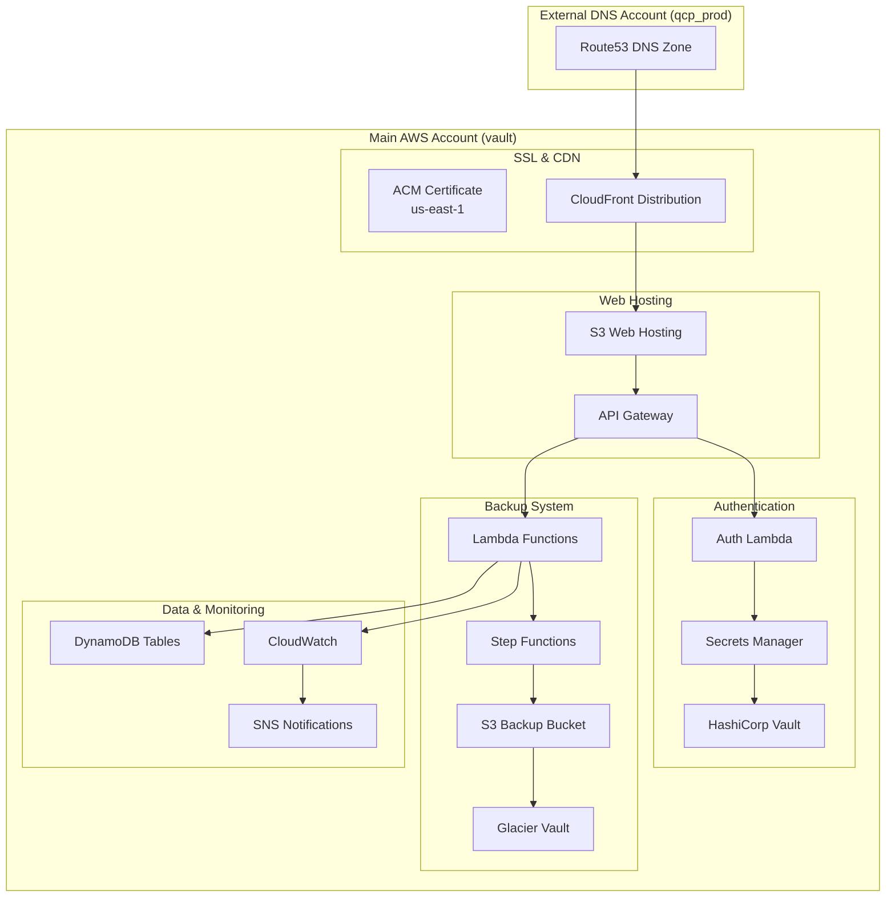

# Terraform Configuration for GitHub Backup System

This directory contains the Terraform infrastructure-as-code for the GitHub Backup System. The configuration is organized into logical modules for better maintainability and understanding.

## 📁 File Structure

### **Core Infrastructure**
- **`providers.tf`** - AWS provider configurations (main, DNS, us-east-1 for ACM)
- **`terraform.tf`** - Terraform version and provider requirements  
- **`variables.tf`** - Input variables and their default values
- **`outputs.tf`** - All output values organized by category
- **`data.tf`** - Data sources for AWS account info and regions
- **`locals.tf`** - Local values and computed expressions

### **Storage & Backup**
- **`s3.tf`** - S3 bucket for backup storage with lifecycle policies
- **`glacier.tf`** - Glacier vault for long-term archival
- **`dynamodb.tf`** - DynamoDB tables for audit trail and metadata

### **Compute & Orchestration**
- **`lambda.tf`** - All Lambda functions (backup, API, auth, email)
- **`stepfunctions.tf`** - Step Functions for workflow orchestration
- **`iam.tf`** - IAM roles and policies for all services

### **Web Interface & API**
- **`web_hosting.tf`** - S3 static website hosting configuration
- **`cloudfront.tf`** - CloudFront CDN with custom domain and SSL
- **`api_gateway.tf`** - REST API Gateway with all endpoints
- **`ssl.tf`** - ACM SSL certificate management
- **`dns.tf`** - Route53 DNS records in external AWS account

### **Security & Authentication**
- **`auth.tf`** - Authentication credentials and JWT secrets
- **`ephemeral.tf`** - Ephemeral token management with Vault

### **Monitoring & Notifications**
- **`cloudwatch.tf`** - CloudWatch logs, EventBridge rules, and scheduling
- **`sns.tf`** - SNS topics for email notifications

### **Documentation**
- **`DNS_SETUP.md`** - Detailed DNS configuration guide
- **`README.md`** - This file

## 🏗️ Architecture Overview



## 🚀 Quick Start

### Prerequisites
1. **AWS CLI** with profiles configured:
   - `vault` - Main backup infrastructure
   - `qcp_prod` - DNS management
2. **Terraform** >= 1.12.2
3. **HashiCorp Vault** access
4. **GitHub Personal Access Token**

### Deployment
```bash
# Initialize Terraform
terraform init

# Review the plan
terraform plan

# Deploy infrastructure
terraform apply

# Get deployment summary
terraform output deployment_summary
```

## 🔧 Configuration

### Key Variables
```hcl
# Domain configuration
custom_domain = "github-backups.cloudportal.app"
dns_zone_name = "cloudportal.app"

# GitHub settings
github_org = "YourOrganization"
notification_email = "admin@yourcompany.com"

# Storage settings
s3_bucket_name = "your-backup-bucket"
retention_days = 30
glacier_retention_years = 2

# Performance tuning
lambda_memory_size_backup = 1024
lambda_timeout_backup = 900
```

### Environment-Specific Overrides
Create a `terraform.tfvars` file for your specific environment:
```hcl
environment = "production"
github_org = "YourOrgName"
notification_email = "backups@yourcompany.com"
custom_domain = "backups.yourcompany.com"
dns_zone_name = "yourcompany.com"
```

## 🔐 Security Features

### Multi-Account Security
- **DNS Isolation**: DNS managed in separate AWS account
- **Cross-Account IAM**: Minimal permissions across accounts
- **Credential Separation**: GitHub tokens in Vault, auth credentials in Secrets Manager

### SSL/TLS Security
- **Modern TLS**: TLS 1.2+ with SNI support
- **Automatic Renewal**: ACM handles certificate lifecycle
- **HSTS Headers**: Security headers via CloudFront

### Authentication Security
- **JWT Tokens**: Secure session management
- **Constant-Time Comparison**: Prevents timing attacks
- **Token Expiration**: Configurable session timeouts

## 📊 Monitoring & Observability

### CloudWatch Integration
- **Lambda Logs**: All functions log to dedicated log groups
- **API Gateway Logs**: Request/response logging
- **Step Functions**: Execution history and state tracking

### Audit Trail
- **DynamoDB Events**: Complete audit log in `backup_events` table
- **Repository History**: Backup metadata in `repository_history` table
- **Download Operations**: Tracking in `download_operations` table

### Alerting
- **SNS Notifications**: Beautiful HTML email reports
- **Error Handling**: Automatic error detection and reporting
- **CloudWatch Alarms**: Optional custom alerting (not included)

## 🗂️ Data Storage

### S3 Bucket Structure
```
s3://bucket-name/
├── nightly/YYYY-MM-DD/
│   └── repository-name.tar.gz
├── final/
│   └── repository-name.tar.gz
└── manifests/
    └── repository-manifest.json
```

### DynamoDB Tables
- **`backup_events`**: Audit trail with GSI on date, repository, event type
- **`repository_history`**: Backup metadata with GSI on storage class
- **`download_operations`**: Download tracking with TTL
- **`glacier_jobs`**: Glacier job status with TTL

## 🔄 Backup Workflow

1. **Discovery** (Daily 1 AM): Find repositories in GitHub organization
2. **Backup** (Daily 2 AM): Step Functions orchestrate parallel backups
3. **Archival** (Monthly 3 AM): Move old backups to Glacier
4. **Cleanup** (Monthly 4 AM): Remove expired archives
5. **Notifications**: Email reports for all operations

## 🌐 Web Interface

### Features
- **Dashboard**: Real-time backup statistics
- **Repository Browser**: Search and filter repositories
- **Backup History**: Detailed backup timeline
- **Download Management**: Self-service backup downloads
- **Audit Logs**: Complete operation history

### Access
- **URL**: https://github-backups.cloudportal.app
- **Authentication**: Admin credentials in Vault
- **API**: RESTful endpoints for automation

## 🛠️ Maintenance

### Regular Tasks
- **Monitor Costs**: Review S3 and data transfer charges
- **Check Logs**: CloudWatch logs for errors or warnings
- **Update Tokens**: GitHub token rotation in Vault
- **Test Downloads**: Periodic backup download testing

### Scaling Considerations
- **Lambda Concurrency**: Adjust for larger organizations
- **DynamoDB Capacity**: Monitor read/write capacity metrics
- **S3 Request Rates**: Consider request rate optimization
- **Glacier Retrieval**: Plan for download time requirements

## 🔍 Troubleshooting

### Common Issues
1. **Certificate Validation**: Check DNS propagation
2. **Cross-Account Access**: Verify IAM permissions
3. **Large Repositories**: Increase Lambda timeout/memory
4. **Rate Limits**: Check GitHub API rate limiting

### Debug Commands
```bash
# Check certificate status
aws acm list-certificates --region us-east-1 --profile vault

# Test DNS resolution
nslookup github-backups.cloudportal.app

# Check Lambda logs
aws logs describe-log-groups --profile vault | grep github-backup

# List S3 backups
aws s3 ls s3://your-backup-bucket/nightly/ --profile vault
```

## 📋 Outputs Reference

After deployment, key outputs include:
- **`web_interface_url`**: Main web interface URL
- **`api_gateway_url`**: REST API endpoint
- **`deployment_summary`**: Quick reference with emojis
- **`cloudfront_distribution_id`**: For cache invalidation
- **`certificate_arn`**: SSL certificate reference

## 🤝 Contributing

When modifying the Terraform configuration:
1. **Follow Naming**: Use consistent resource naming patterns
2. **Add Tags**: Include environment and project tags
3. **Document Changes**: Update this README for significant changes
4. **Test Thoroughly**: Use `terraform plan` before applying
5. **Organize Logically**: Keep related resources in appropriate files

## 📚 Additional Resources

- [DNS Setup Guide](DNS_SETUP.md) - Detailed DNS configuration
- [AWS Lambda Best Practices](https://docs.aws.amazon.com/lambda/latest/dg/best-practices.html)
- [Terraform AWS Provider](https://registry.terraform.io/providers/hashicorp/aws/latest/docs)
- [GitHub API Documentation](https://docs.github.com/en/rest)